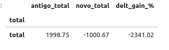
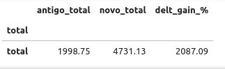
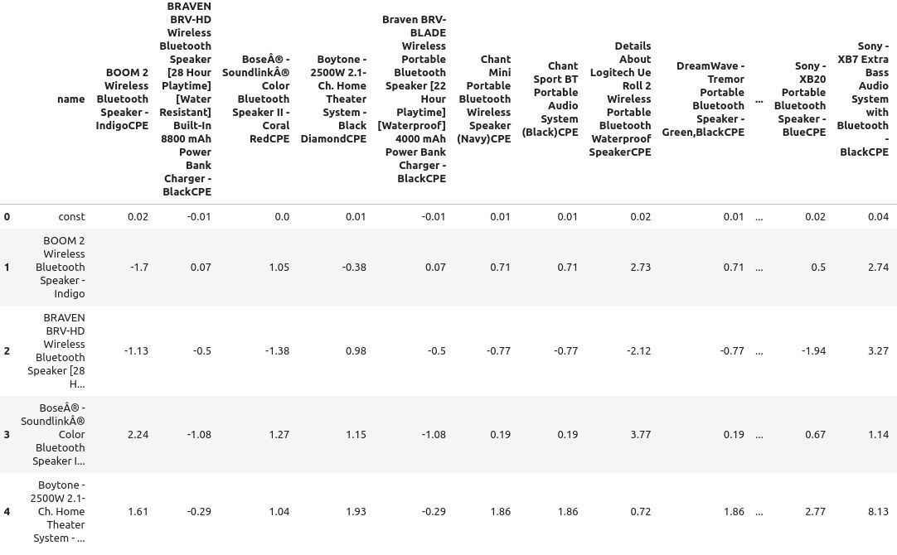

 

groups](imagem/Ecommerce-Website.jpg) 

  

Este é um projeto fictício. Com dados públicos dos [E-commerce](https://billionaire365.com/2019/02/25/what-is-an-ecommerce-website/)
 das empresas Amazon, Bestbuy, barcodable , bhphotovideo, ebay, kmart e Walmart.
# 0 Resumo sobre o projeto

## 0.1 Modelo de Negócio

* E-commerce

## 0.2 Sede da empresa

1. **Amazon**
   - Sede: Seattle, Washington, EUA
   - Site: [Amazon](https://www.amazon.com)

2. **Best Buy**
   - Sede: Richfield, Minnesota, EUA
   - Site: [Best Buy](https://www.bestbuy.com)

3. **Barcodable**
   - Sede: Orlando, Florida, EUA
   - Site: [Barcodable](https://www.barcodable.com)

4. **B&H Photo Video**
   - Sede: Nova York, Nova York, EUA
   - Site: [B&H Photo Video](https://www.bhphotovideo.com)

5. **eBay**
   - Sede: San José, Califórnia, EUA
   - Site: [eBay](https://www.ebay.com)

6. **Kmart**
   - Sede: Hoffman Estates, Illinois, EUA
   - Site: [Kmart](https://www.kmart.com)

7. **Walmart**
   - Sede: Bentonville, Arkansas, EUA
   - Site: [Walmart](https://www.walmart.com)

## 0.3 Tipo de produto
 
* tv, television, video,
* laptop, computer
* speaker, portable, bluetooth
* camera, mirrorless, photo
* car, speaker e subwoofer
* receiver, amplifier, home
* camera, shoot
* drive, storage, hard
* drive, storage, internal
* car, receiver, dash
* player, home, audio
* headphone, earbud, ear
* headphone
* ipod, player
* ...

## 0.4 Problema

* Falta de conhecimento sobre como o aumento dos preços ou redução impacta as vendas (demanda pelo produto).
   * Decisões de Preço Inadequadas.
   * Perda de Clientes.
   * Gestão de Estoque Ineficiente.
   * Estratégia de Marketing Ineficaz.
   * Segmentação de Mercado Incorreta.
   * Problema de Competitividade.
   * Impacto nas Finanças.
   * Reputação da Marca.
 

## 0.5 Solução

* A solução inicial - Calcular a elasticidade dos preços.
  * Insights

## 0.6 Impacto da solução

* Personalizar a experiência ou adptar
  * Comunição.
  * Ofertas.
  * Recomendação.
* Segmentação de Marketing mais eficientes.
* Otimização do Estoque.

   ... 

*****************************************************************************************************************************************************************************

  

## 1. Problema de negócios 

### 1.1 Problema 

Uma empresa pretende alterar os preços dos produtos vendidos, mas tem receio dessa alteração impactar na demanda desses produtos e por consequência no faturamento. Essa demanda foi submetida para mim e como analista/cientista de dados preciso determinar a elasticidade dos preços usando a metodologia científica embasado nos dados dos preços dos produtos vendidos pela empresa.

  

### 1.2 Motivação 

Maximizar o lucro por meio dos melhores ajustes dos preços. 

  

  

### 1.3 Demandas de negócio 

  

Produto de dados solicitado: 

* Estudo do impacto da alteração de preço sobre a vendas do produto, em primeiro momento concentrado na categoria speaker, portable, bluetooth. O produto speaker. 

  

  

## 2. Premissas de negócio 

  
### 2.1 Entrega
- Todos os produtos de dados entregues devem ser acessíveis via internet.
- O planejamento da solução será validado com os times de negócio, visando garantir que as soluções desenvolvidas sejam úteis na sua tomada de decisão.
### 2.2 Validação estatística

#### 2.1 R² ou R-squared
* Tende a 1 quando o modelo trabalha com somente um produto.  
* Vária de 0.13 a 0.50 quando com vários produtos.
#### 2.2 p-value
Foram filtrados os resultados da elasticidade do preço para somente produtos com uma p-value estatística menor a 15%.

  

## 3. Planejamento da solução 

* Baixar os dados e ler os dados

* Executar o processo de limpeza de dados como:

	* renomear colunas

	* renomear categorias mudar de tipo de variável, caso necessário

* Estatística descritiva com visualização

* Feature Engineering

* Machine Learning

* Elasticidade

* Business Performance

* Cross Price Elasticity

### 3.1. Produto final 

  

O que será entregue efetivamente? 

- Um gráfico com a elesticidade de preços e os nomes do produtos
- Uma tabela com as elasticidade de preços e os nomes do produtos

  

### 3.2. Ferramentas 

  

Quais ferramentas serão usadas no processo? 

- Pyenv; 

- Jupyter Notebook; 

- Git, Github; 

- Python; 

- streamlit; 

- Sistema Linux. 

  

  

  

## 4. Resultados para o negócio 

  

### 4.1 Resultados 

  
								Imagem - Resultado

  

  

Interpretando os resultados da imagem resultado. Para casos com a elasticidade negativa ou inelástica, traz a informação que os clientes não são muitos sensíveis à variação do preço do produto, para empresa representar uma maior flexibilidade para definir o preço, podendo aumentar sem afetar significativamente a quantidade demandada. Entretanto, a redução do preço não necessariamente resultarão em um aumento da quantidade demandada.  Produtos do index 0 (BOOM 2 Wireless Bluetooh Speaker -Indigo), 1, 2 e 7. Para os produtos, elástico, deve ter um cuidado com aumento do preço, pois, seus clientes são sensíveis. Se aumentar o preço, reduzirá drasticamente a demanda, contudo, se reduzir, pode gerar um aumento significativo de vendas. Exemplo dos produtos com o index 3, 4, 5 e 6.
  

Como resultado para o negócio foram criados: 

  

* Dataset ou conjunto de dados com a elasticidade dos preço e outras informações estatística como p-value. 

  

 ## 4.2 Business Performance
 
 ### 4.3 Simulação de aumento
 O aumento nos preços dos produtos em 15% sem analisar a elasticidade do preço da demanda, gerou o seguinte resultado na imagem - "Situação de aumento, resultado total". E ainda na imagem abaixo desta, imagem - "Situação de aumento, resultado detalhado." 
 
								Imagem - Situação de aumento, resultado total.

  

								Imagem - Situação de aumento, resultado detalhado.

  

 ### 4.4 Simulação de desconto
 O desconto de 15% com a análise da elasticidade do preço da demanda, gerou o seguinte resultado na imagem 

  
								Imagem - Situação de aumento, resultado total. 

  

								Imagem - Situação de aumento, resultado detalhado.
 

  

 ## 4.3 Cross Price Elasticity
A seguir o resultado do Cross Price dos demais produtos com BOOM 2 Wireless Bluetooth Speaker - Indigo, como mostra a imagem - Cross price com BOOM 2 Wireless Bluetooth Speaker - Indigo. Além disso, a imagem - Resultado de cross price com BOOM 2 Wireless Bluetooth Speaker - Indigo, mostra o resultado do cross Price que nos diz se existe uma relação entre os produtos.
![Situação de cross price com BOOM 2 Wireless Bluetooth Speaker - Indigo]   

								Imagem - Cross price com BOOM 2 Wireless Bluetooth Speaker - Indigo
 

  

 								Imagem - Resultado de cross price com BOOM 2 Wireless Bluetooth Speaker - Indigo
 

## 5. Conclusão 

  

* O objetivo foi alcançado, dado que o produto de dados foram gerados com sucesso. O funcionario pode utilizar a ferramenta criado para fazer a elasticidade de preço. 

  

  

  

[Dashbord no streamlit](https://elasticidade-dashbord.streamlit.app/) 

  

  

## 6. Próximos passos 

  

Algumas melhorias no projeto podem ser incrementadas no futuro: 

  

* Carregar os dados em servidor. 

* Deploy do modelo. 

* Criar um botão com api do modelo de Machine Learning no google sheets para que resultado seja emitido nele com as médias de característica dos clientes. 

* Deixar um dashbord no streamlit ou metabase com informações dos dados. 

  

## 7 Referências 

* Este Projeto foi feito como parte do curso "DS em Produção", da [Comunidade DS](https://www.comunidadedatascience.com/). 

* O Dataset foi obtido no curso de Ciência de dados da [Comunidade DS](https://alunos.comunidadeds.com/auth/login?redirect=%2F%3Futm_source%3Dinstall). 

  

  

  

  

  

  

  

  

  

  

  

  

  

  

  

  

#### Observação:  

**Python 3.12.3** 
